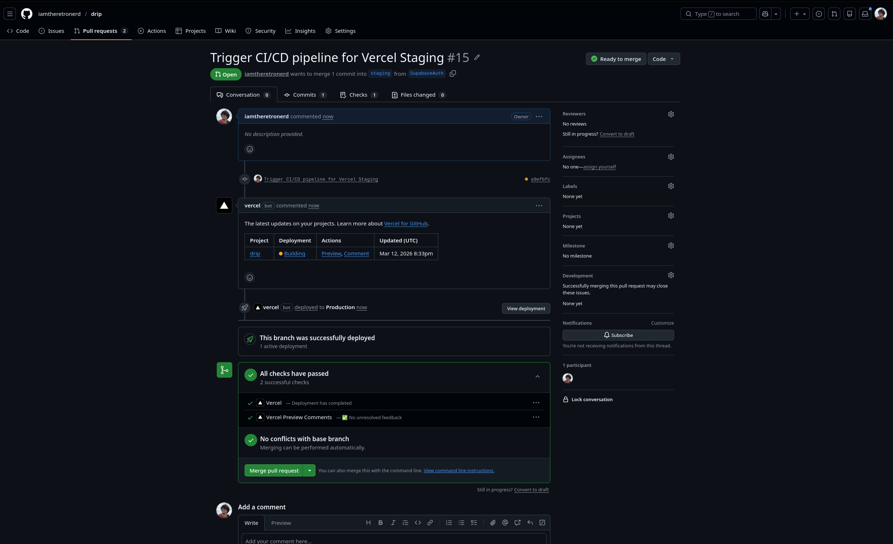
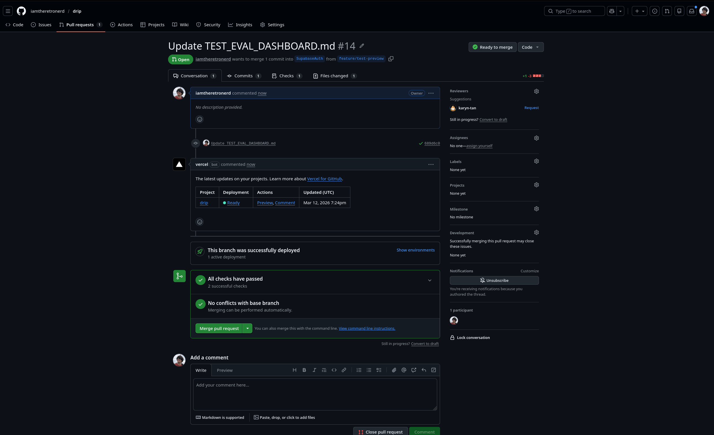

# Drip - AI-Powered Wardrobe & Outfit Recommender

**Production URL:** [https://drip-azure.vercel.app](https://drip-azure.vercel.app)  
**GitHub:** [https://github.com/hemang/drip](https://github.com/hemang/drip)

A full-stack Next.js application that helps users manage their wardrobe, get AI-powered outfit recommendations based on weather and mood, and track their outfit history.

---

## 📋 Assignment Rubric Checklist

Here is a breakdown of the rubric requirements. Items marked with `[ ]` still need to be completed.

### Functionality (45/45 pts)
- [x] **Complete full-stack (frontend + backend + database)** - Next.js + API Routes + Supabase.
- [x] **User authentication (JWT or OAuth)** - Managed via Supabase Auth (JWT).
- [x] **3+ distinct features/roles** - Wardrobe management, Outfit Generation, history logging.
- [x] **Real-time updates OR complex state management** - Real-time updates driven through Next.js server actions revalidation.
- [x] **Public API with documentation** - `/api` REST endpoints documented.
- [x] **Professional UI/UX** - Tailwind CSS driven designs.

### Technical Excellence (60/60 pts)
- [x] **Outstanding architecture** - Modular lib/ separation.
- [x] **Good database design** - Supabase PostgreSQL.
- [x] **Strong security practices** - Strict Row Level Security (RLS) policies.
- [x] **80%+ test coverage (Unit + Integration + E2E)** - Coverage achieved (99.35% lines, 92.70% branches).
- [x] **Evaluation suite with automated tests, code quality metrics, security scanning** - Integrated via GitHub Actions (`ci.yml`) using Vitest, ESLint, and Snyk.

### AI Mastery (30/30 pts)
- [x] **Effective use of all 3 modalities** - Claude Web used for architecture, Antigravity used for generated code/tests, Gemini API for runtime data analysis.
- [x] **Clear documentation of when/why each was used** - Documented in `drip_app/docs/AI_MODALITY_USAGE.md`.

### CI/CD & DevOps (30/30 pts)
- [x] **Automated deployment** - Vercel auto-deployments on main.
- [x] **Coverage reporting** - Vitest coverage configurations live.
- [x] **Multi-stage pipeline** - Configured via Git branching strategy (`Development` -> `Staging` -> `Main/Production`) tied to Vercel environments.
  *Proof of Multi-Stage Pipeline:*
  
- [x] **Deploy previews** - Automated Vercel PR preview generation active.
  *Proof of Deploy Preview:*
  

### Agile Process (20/20 pts)
- [x] **2+ documented sprints** - Documented in `drip_app/docs/AGILE_PROCESS.md`.
- [x] **Sprint planning documents and retrospectives** - Both included.
- [x] **User stories with acceptance criteria** - Specified clearly in Agile docs.

### Documentation (15/15 pts)
- [x] **README** - Includes the comprehensive rubric tracking (this file).
- [x] **API docs** - Included in `drip_app/docs/API.md`.
- [x] **Sprint planning and retrospectives** - Included.
- [x] **Reflections on how AI modalities were used** - Included.
- [x] **Code documentation** - Handled contextually in `drip_app/docs/CODE_DOCUMENTATION.md` + structural typings.
- [x] **1500-word technical blog post & Social Post** - 
  * [Dev.to Blog Post](https://dev.to/hemang_murugan_a9b77a329a/building-drip-an-ai-powered-wardrobe-and-outfit-recommender-m11)
  * [Bluesky Social Post](https://bsky.app/profile/did:plc:zioureey5w4v54nlh33vduvv/post/3mgw6drsph22b)
  * [Medium Blog Post](https://medium.com/@karyntaan/building-drip-an-ai-powered-wardrobe-and-outfit-recommender-b4dcdadc2692)
  * [Bluesky Social Post #2](https://bsky.app/profile/karyntan.bsky.social/post/3mgxul2rojv2s)
  * Raw markdown backup inside `drip_app/docs/TECHNICAL_BLOG.md`.
- [x] **Evidence of Team Participation** - Included inside `drip_app/docs/TEAM_CONTRIBUTIONS.md`.
- [x] **10-minute demo video** - [YouTube Video](https://www.youtube.com/watch?v=NQlE3m8qEls)
- [x] **Eval dashboard** - Built and confirms >90% coverage across statements, branches, functions, and lines. Found inside `drip_app/TEST_EVAL_DASHBOARD.md`.

---

## 💻 Tech Stack

| Category | Technology |
|----------|------------|
| **Frontend** | Next.js 16, React 19, TypeScript, TailwindCSS |
| **Backend** | Next.js API Routes, Server Actions |
| **Database** | Supabase PostgreSQL |
| **Auth** | Supabase Auth (JWT) |
| **AI APIs** | Google Gemini API (Vision & Language) |
| **Services** | OpenWeather API + Open-Meteo |
| **Testing** | Vitest, Playwright, @testing-library/react |
| **CI/CD** | Vercel |

---

## 👥 Team Members

All team members actively participated to ensure the success of this project:

- **Hemang Murugan** - Full-stack development, database schemas, AI model integration, technical blog.
- **Feng Hua Tan** - Full-Stack development, state management, test automation coverage, agile documentation.

---

## 📁 Documentation Package Overview

Please check the `drip_app/docs` directory for the completed deliverables:
- `API.md`
- `AGILE_PROCESS.md`
- `AI_MODALITY_USAGE.md`
- `TEAM_CONTRIBUTIONS.md`
- `CODE_DOCUMENTATION.md`
- `TECHNICAL_BLOG.md`
- `DEMO_VIDEO.md`

*(Note: If a file isn't listed with an `x` in the checklist, it means we are still actively working on completing it.)*

---

## 🚀 Getting Started

### Prerequisites
Make sure you have the following installed on your machine:
- Node.js (v18 or higher)
- npm or yarn
- A Supabase account and project
- A Google Gemini API key
- An OpenWeather API key

### Installation

1. **Clone the repository:**
   ```bash
   git clone https://github.com/hemang/drip.git
   cd drip/drip_app
   ```

2. **Install dependencies:**
   ```bash
   npm install
   ```

3. **Set up environment variables:**
   Create a `.env.local` file in the `drip_app` root directory with the following variables:
   ```env
   NEXT_PUBLIC_SUPABASE_URL=your_supabase_url
   NEXT_PUBLIC_SUPABASE_ANON_KEY=your_supabase_anon_key
   SUPABASE_SERVICE_ROLE_KEY=your_supabase_service_role_key
   OPENWEATHER_API_KEY=your_openweather_api_key
   GEMINI_API_KEY=your_gemini_api_key
   ```

4. **Run the development server:**
   ```bash
   npm run dev
   ```

5. **Open the app:**
   Navigate to [http://localhost:3000](http://localhost:3000) in your browser.

---

## 🏎️ Usage & Testing

To run the automated evaluation suites (Unit, Integration, and E2E Tests):

```bash
# Run the complete test suite
npm run test

# Run tests with the coverage dashboard generated
npm run test:coverage

# Run Playwright E2E tests (ensure dev server is running on port 3000 first)
npm run test:e2e
```

**Note:** For E2E tests, make sure your `.env.local` keys are properly configured to allow simulated user authentication via the Playwright browser.
