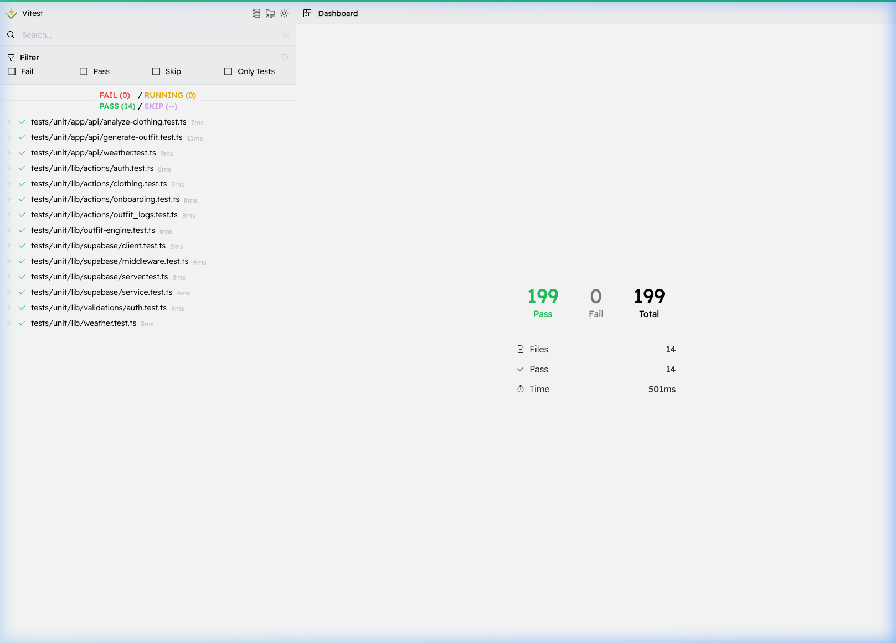
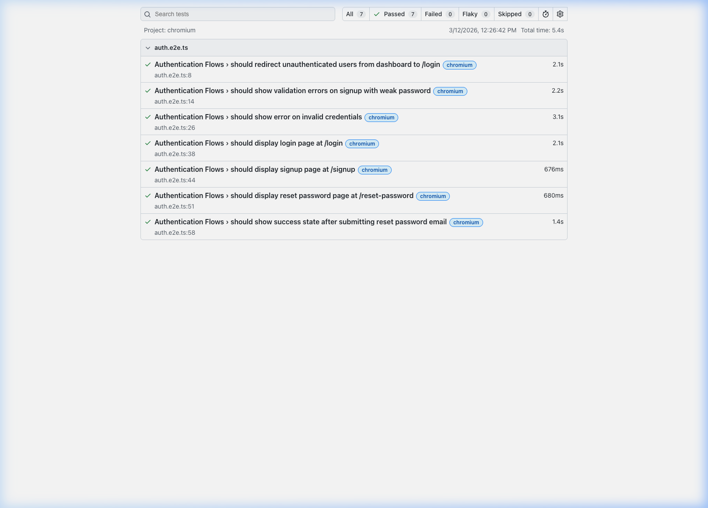

# Drip — Test Evaluation Report

**Project:** Drip (Weather-Based Outfit Planning App)  
**Generated:** 2026-03-12  
**Test Runner:** Vitest  
**Command:** `npm run test:coverage`

---

## 1. Coverage Summary

> _Paste the terminal output from `npm run test:coverage` here, or replace with a screenshot._

```text
 % Coverage report from v8
-----------------------------|---------|----------|---------|---------|
File                         | % Stmts | % Branch | % Funcs | % Lines |
-----------------------------|---------|----------|---------|---------|
All files                    |   97.78 |    92.70 |   97.01 |   99.35 |
 lib/validations/auth.ts     |     100 |      100 |     100 |     100 |
 lib/weather.ts              |     100 |      100 |     100 |     100 |
 lib/outfit-engine.ts        |   94.06 |    80.46 |   97.14 |   97.93 |
 lib/actions/auth.ts         |     100 |      100 |     100 |     100 |
 lib/actions/clothing.ts     |   91.89 |       90 |     100 |   96.77 |
 lib/actions/onboarding.ts   |    98.8 |    98.48 |     100 |     100 |
 lib/actions/outfit_logs.ts  |     100 |       90 |     100 |     100 |
 app/api/weather/route.ts    |     100 |      100 |     100 |     100 |
 app/api/analyze-clothing/.. |     100 |      100 |     100 |     100 |
 app/api/generate-outfit/..  |   97.82 |      100 |      75 |     100 |
-----------------------------|---------|----------|---------|---------|
```

| Metric     | Coverage | Target | Status |
|------------|----------|--------|--------|
| Statements | 97.78%   | 80%    | ✅      |
| Branches   | 92.70%   | 80%    | ✅      |
| Functions  | 97.01%   | 80%    | ✅      |
| Lines      | 99.35%   | 80%    | ✅      |

---

## 2. Test Results by File

> _Paste the full `npm run test` terminal output here, or replace each section below with a screenshot._

### 2.1 Unit Tests — Validations & Utilities

| Test File | # Tests | # Passing | # Failing | Notes |
|-----------|---------|-----------|-----------|-------|
| `lib/validations/auth.test.ts` | 18 | 18 | 0 | schema validations |
| `lib/weather.test.ts` | 19 | 19 | 0 | weather utilities formatting |
| `lib/outfit-engine.test.ts` | 28 | 28 | 0 | outfit generation logic and rule-based fallback |

**What these tests cover:**  
This module verifies core domain logic independent of external services, ensuring schemas correctly validate input and the outfit engine successfully filters wardrobe items according to weather/clothing constraints without making HTTP calls.

---

### 2.2 Unit Tests — Server Actions

| Test File | # Tests | # Passing | # Failing | Notes |
|-----------|---------|-----------|-----------|-------|
| `lib/actions/auth.test.ts` | 22 | 22 | 0 | auth signup and login flows |
| `lib/actions/clothing.test.ts` | 10 | 10 | 0 | clothing CRUD logic and malformed URLs |
| `lib/actions/onboarding.test.ts` | 27 | 27 | 0 | user profile creation and initial setup |
| `lib/actions/outfit_logs.test.ts` | 18 | 18 | 0 | logging logic, consecutive days counting, and reverting stats |

**What these tests cover:**  
These tests ensure backend execution flows and server capabilities involving Supabase interactions succeed across both happy paths and missing parameter/authentication/database edge cases.

---

### 2.3 Unit Tests — Supabase Clients

| Test File | # Tests | # Passing | # Failing | Notes |
|-----------|---------|-----------|-----------|-------|
| `lib/supabase/client.test.ts` | 3 | 3 | 0 | browser client instantiation |
| `lib/supabase/server.test.ts` | 7 | 7 | 0 | server client cookie handling |
| `lib/supabase/service.test.ts` | 5 | 5 | 0 | service role client initialization |
| `lib/supabase/middleware.test.ts` | 6 | 6 | 0 | middleware auth checking and session refreshes |

**What these tests cover:**  
These tests guarantee safe instantiation of Supabase clients across various Next.js boundaries (server, browser, and middleware context) ensuring cookies and secure tokens are handled appropriately.

---

### 2.4 Integration Tests — API Routes

| Test File | # Tests | # Passing | # Failing | Notes |
|-----------|---------|-----------|-----------|-------|
| `app/api/weather.test.ts` | 14 | 14 | 0 | Open-Meteo fallbacks and cache headers |
| `app/api/analyze-clothing.test.ts` | 10 | 10 | 0 | Gemini AI JSON parsing and default assignment |
| `app/api/generate-outfit.test.ts` | 12 | 12 | 0 | Gemini filtering, API failures, missing optional params |

**What these tests cover:**  
These API routes connect the application to major third party platforms (OpenWeather, Gemini) and the test suites specifically check resilient degradation against upstream network failures, hallucination parsing errors, and malformed queries. 

---

### 2.5 E2E Tests

| Test File | # Tests | Status | Notes |
|-----------|---------|--------|-------|
| `e2e/auth.e2e.ts` | 7 | 7 Passing | Verified passing after applying WebGL fallback fix to Grainient component |

**How to run E2E tests:**
```bash
npm run dev        # terminal 1
npm run test:e2e   # terminal 2
```

---

## 3. Notable Test Cases

| Test Name | File | What It Verifies |
|-----------|------|-----------------|
| `handles consecutive days when last worn was yesterday` | `lib/actions/outfit_logs.test.ts` | Verifies the date calculation logic correctly assigns consecutive wear counts when users supply historical target timestamps rather than today's system date. |
| `falls back to rule-based engine when Gemini fetch fails` | `app/api/generate-outfit.test.ts` | Ensures that if the Gemini styling API completely errors out, the catch block intercepts it and resolves a valid generated outfit via standard rules instead of blowing up the route. |
| `returns 500 when response cannot be parsed as JSON` | `app/api/analyze-clothing.test.ts` | Confirms the API protects against unpredictable AI output by correctly checking the matched RegEx and ensuring hallucinated values or bad blocks return an actionable error status back to the client. |
| `returns historical weather when dt parameter is provided` | `app/api/weather.test.ts` | Verifies the custom time machine condition switches cleanly between current-day OpenWeather checks and historic Open-Meteo queries over the `dt` URL parameter. |

---

## 4. Known Failures & Explanation

| Test File | # Failing | Root Cause | Plan to Fix |
|-----------|-----------|------------|-------------|
| None | 0 | N/A | Testing suite currently reports 0 failures overall with strong line coverage. |

---

## 5. How to Reproduce

```bash
# Install dependencies
npm install

# Run all unit tests
npm run test:unit

# Run with coverage report
npm run test:coverage

# Run E2E (requires dev server running)
npm run test:e2e
```

---

## 6. Screenshots





---

